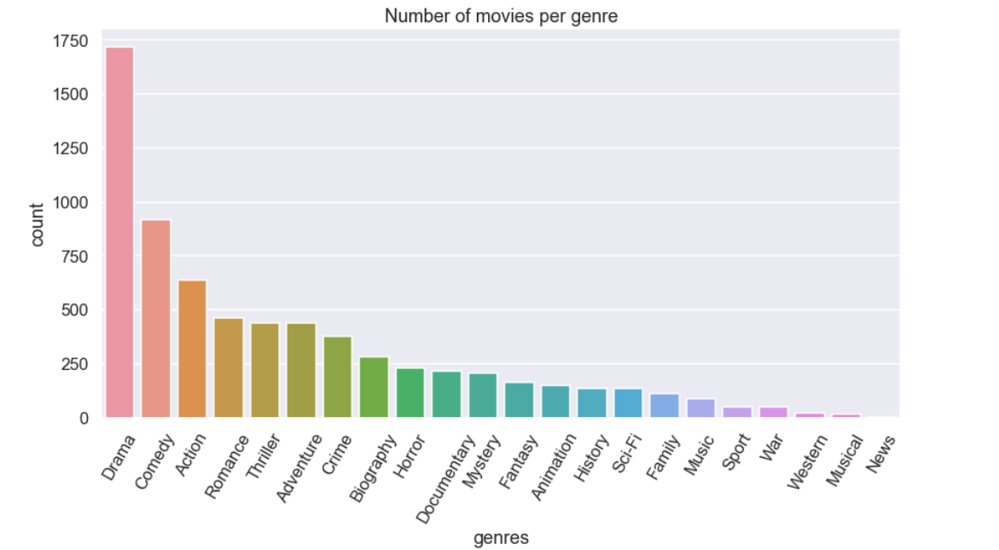

# MICROSOFT MOVIE ANALYSIS

Author: Scholar Chepkirui

## Overview 
This project uses exploratory data analysis to generate insights for Microsoft Corporation, which wants to create a new movie studio. Based on the datasets from IMDB and Box Office Mojo, recommendations are made on the types of films that Microsoft needs to explore. The metrics used to determine the success and popularity of a genre are the total gross incomes and the average rating of the genre. Generally, the findings show that Microsoft should focus on Sci-Fi, adventure, animation and action genres due to the higher total gross income generated.

## Business Problem

Microsoft sees all the big companies creating original video content and they want to get in on the fun. They have decided to create a new movie studio, but they don’t know anything about creating movies. You are charged with exploring what types of films are currently doing the best at the box office. You must then translate those findings into actionable insights that the head of Microsoft's new movie studio can use to help decide what type of films to create.
The questions answered by this analysis include:
- What are the number of movies per genre?
- Which genre of movies have the highest gross income?
- Which genre of movies have a higher average rating?
- What is the relationship between the average rating and the gross income?
- What is the domestic gross and foreign gross income by start year of the movies?

## Data
The datasets used in this analysis are from IMDB and Box Office Mojo. The three datasets are briefly explained below:
- imdb.title.basics: Contains information about movie titles such as primary title, original title, start year, runtime minutes  and genres.
- imdb.title.ratings: Contains the IMDb rating and votes information for titles.
- bom.movie_gross: Contains the domestic gross and foreign gross for the movie titles.

## Methods
This project uses exploratory descriptive analysis. The steps taken to achieve useful insights include importing the required libraries and loading the datasets, data understanding, data cleaning and data visualization.

## Results
Drama, comedy and action are the genres that have the highest number of movies released in this dataset. Drama and comedy are probably the largest film genres because they include a broad spectrum of films. 
The genres with the least number of movies are war, western, musical and news. These genres are more specific based on the plot of the movie.

## Conclusions and recommendations
- The genres of most of the movies that have been released are drama, comedy and action.
- From the dataset available, the popularity and success of a given genre can be determined based on the average rating of the genre or the total gross income of the genre.
- Documentary, biography and sport have the highest average rating while Sci-Fi, adventure, animation and action have the highest total gross income.Despite documentary and biography having the highest average rating, they have a very low income.There is no clear relationship between the total gross income and the average rating.
- Microsoft should consider focusing on genres with the highest total gross income in order to get higher returns on their investment. These genres are Sci-Fi, adventure, animation and action. They seem to appeal to a broad audience hence have a high theatrical box office earnings.
- Microsoft should focus on exploring more the international markets which have had a higher gross over the years when compared to the domestic markets. The movies created should consider the interests of the international market.
- Due to the drastic drop in the gross from theatrical earnings for movies released in 2019, Microsoft should look into other sources of revenue and invest in them.

## Future work
- Further research should be done to determine the best time of the year to release a movie of a certain genre.
- It is beneficial to determine whether the total gross income of a genre increases proportionally if the production, development, marketing, and advertising budgets of the movie are increased. This can help in predicting the profits based on the budget.
- Other than theatrical earnings, there are other sources of revenue for studios such as home entertainment sales and rentals, television rights, product placement fees and streaming services. It would be important to collect data about these sources of revenue and compare them to the revenue from the theatre earnings.

##  For More Information

## Repository Structure
├── data
├── images
├── README.md
├── Animal_Shelter_Needs_Presentation.pdf
└── animal_shelter_needs_analysis.ipynb